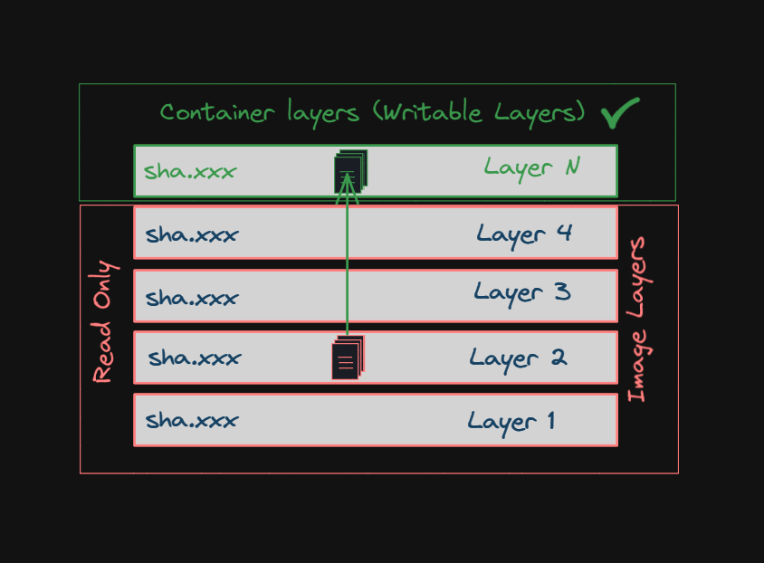

# 🚀 Mastering Docker Volumes | Complete Guide

Welcome to this **complete guide on Docker Volumes**! In this video, we'll go from basics to advanced topics, ensuring you're fully equipped to manage persistent data in Docker. Let's dive in! 🐳💡
## 📌 What Are Docker Volumes?

Docker volumes are **persistent storage** mechanisms used by containers to store data outside of the container’s writable layer.
- Containers are **ephemeral** – when removed, their data is lost.
- Volumes ensure your **data persists**, even after container deletion. like: Logs, generated files, user upload
🧠 Think of volumes as hard drives attached to your containers.

### Why Use Docker Volumes?
**Data Persistence:** Retain data even after the container is stopped or deleted.
**Data Sharing:** Share data between multiple containers.
**Ease of Backup:** Volumes can be easily backed up and restored.
**Performance:** Volumes provide better I/O performance than bind mounts.

## 🛠️ Types of Docker Storage

There are three main storage options in Docker:
1. **Volumes** (Managed by Docker)
2. **Bind mounts** (link to host machine directories)
3. **tmpfs mounts** (stored in memory)

💡 **Volumes** are the most **portable, secure, and recommended** option.
## 📌Docker Container Without volume 

But before understanding above volumes we will see first losses of data when we go with without volumes.
Here we will understand how Docker manages **read-write layers**, **data persistence**, and what happens **when volumes are not used**. We'll simulate and observe:
- Layer creation
- File system overlays
- What gets persisted, what gets lost
- Tracking custom changes
- Container layer internals with real inspection 🕵️‍♂️
## 🧱 Conceptual Foundation

| Layer Type               | Description                                                                      |
| ------------------------ | -------------------------------------------------------------------------------- |
| **Base Image**           | Read-only layers built from Dockerfile or pulled image (`ubuntu`, etc.)          |
| **Intermediate**         | Each `RUN`, `COPY`, or `ADD` in a Dockerfile adds a read-only intermediate layer |
| **Container Layer (RW)** | Writeable layer added on top of the image when a container is started            |
## 🧪 Step-by-Step Hands-On Practice (Without Docker Volumes)

### 🔹 Step 1: Pull and Inspect Image

```bash
docker pull ubuntu:latest
docker image history --no-trunc ubuntu:latest
docker image history ubuntu:latest
# We will see deep dive of image layers in image video series.
dive ubuntu:latest  
# Visual tool for layer inspection (install if needed)
# https://github.com/wagoodman/dive
```

### 🔹 Step 2: Run Container Without Volume

```bash
docker run -itd --name=novolume ubuntu /bin/bash
```

Inside the container:

```bash
docker ps
docker exec -it novolume /bin/bash
echo "Welcome to DevOps in Action!" > ibrar.txt
cat ibrar.txt
exit
```

### Understand The Docker Filesystem
Docker containers run the software stack defined within an Docker image. Images are made of a set of read-only layers that work on a filesystem called the Union Filesystem. When we start a new container, Docker adds a read-write layer on top of the image layers enabling the container to run as if it’s on a standard Linux filesystem.

So, any file change inside the container creates a working copy in the read-write layer. However, when the container is stopped or deleted, that read-write layer is lost:



### 🔹 Step 3: Verify Container and Find File Location and Deference

```bash
# Get layered details
docker inspect novolume | jq '.[0].GraphDriver'
# ID: Unique identifier for the overlay2 layer used by the container.
# LowerDir: Read-only base layers stacked below the container's writable layer.
# MergedDir: The unified view (read/write) of all layers mounted and used by the container.
# UpperDir: The top writable layer where changes made by the container are stored.
# WorkDir: Temporary working directory used internally by overlay2 for layer operations.
# Name: Name of the storage driver in use (in this case, overlay2).

# Check UpperDir
docker inspect novolume --format '{{ .GraphDriver.Data.UpperDir }}'

# Check differences
docker diff novolume
or
UpperDir=$(docker inspect novolume --format '{{ .GraphDriver.Data.UpperDir }}')
sudo ls $UpperDir
sudo cat $UpperDir/ibrar.txt
sudo stat $UpperDir/ibrar.txt
```

👉 You’ll see `ibrar.txt` in the RW layer.

### 🔹 Step 4: Container Restart – Persistence Check

```bash
docker restart novolume
docker exec -it novolume /bin/bash
cat ibrar.txt
exit
```

✅ File still exists — because container is still active.

### 🔻 Step 5: Container Deletion = Data Loss!

```bash
# Remove container
docker rm -f novolume
# Check Data loss:
UpperDir=$(docker inspect novolume --format '{{ .GraphDriver.Data.UpperDir }}')
sudo ls $UpperDir/ibrar.txt # ❌ File is gone

# Recreate again to recover data loss
docker run -itd --name=novolume ubuntu /bin/bash
# Again Check Data loss:
sudo ls $UpperDir/ibrar.txt # ❌ File is gone no recovery possible.
```

## 🧪What Happens When You Delete a Docker Container?
Do practice of below containers from your end and see data losses.

```bash
# MySQL
docker run -d --name mysql -e MYSQL_ROOT_PASSWORD=rootpassword -e MYSQL_DATABASE=mydb -e MYSQL_USER=myuser -e MYSQL_PASSWORD=mypassword -p 3306:3306 mysql:8.0
# Jenkins
docker run -d --name jenkins -p 8080:8080 -p 50000:50000 jenkins/jenkins:lts
# Grafana
docker run -d --name=grafana -p 3000:3000 grafana/grafana
```

## 🛡️ Step 6: How to Avoid Data Loss

To prevent data loss, you can use:
- **Docker Volumes**: Persistent storage managed by Docker.(Reccomended)
- **Bind Mounts**: Map a host directory to a container path.(Good for Dev and Test)
- **Copy Data Out**: Use docker cp to extract files before removing containers(Not a best practices.
## 🎯 Final Thoughts

Always use Docker volumes in production to avoid data loss and for better performance.


---

## 💼 Connect with me 👇👇 😊

- 🔥 [**Youtube**](https://www.youtube.com/@DevOpsinAction?sub_confirmation=1)
- ✍ [**Blog**](https://ibraransari.blogspot.com/)
- 💼 [**LinkedIn**](https://www.linkedin.com/in/ansariibrar/)
- 👨‍💻 [**Github**](https://github.com/meibraransari?tab=repositories)
- 💬 [**Telegram**](https://t.me/DevOpsinActionTelegram)
- 🐳 [**Docker**](https://hub.docker.com/u/ibraransaridocker)

---

## ⭐ Hit the Star!

_**If this helped you, please star the repo and share it. Thanks!**_ 🌟