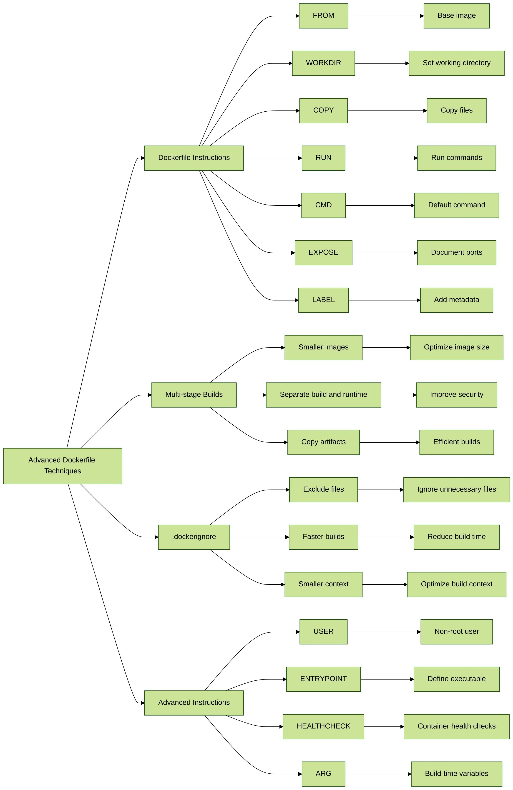

# 🐳 Day 20:  Mastering Dockerfile⚔ Part 1 – Dockerfile Advanced Series Overview

### What is a Dockerfile?

A **Dockerfile** is a **text file** that contains a set of instructions used by Docker to build a container image. Each instruction in the Dockerfile tells Docker how to build the image step by step.

### Basic Structure of a Dockerfile

Here are common **Dockerfile instructions** (keywords):

| Instruction        | Description                                                                                                         |
| ------------------ | ------------------------------------------------------------------------------------------------------------------- |
| **ADD** 📦         | Adds files, directories, or remote URLs to the image. Automatically extracts archives like `.tar`.                  |
| **ARG** ⚙️         | Defines variables available only during the build stage. Useful for passing secrets or build-time configs.          |
| **CMD** 🛠️        | Sets the default command to run when the container starts. Can be overridden by `docker run` arguments.             |
| **COPY** 📁        | Copies files/directories from the local context to the image. More predictable than `ADD`, no archive extraction.   |
| **ENTRYPOINT** 🚪  | Sets the main command that always runs in the container. Great for creating CLI wrappers or boot scripts.           |
| **ENV** 🌍         | Sets environment variables inside the container. These persist across RUNs and at runtime.                          |
| **EXPOSE** 📡      | Documents which ports the container listens on. Doesn’t actually publish the port.                                  |
| **FROM** 🏗️       | Specifies the base image to build from. Supports multi-stage builds using `AS`.                                     |
| **HEALTHCHECK** 🩺 | Defines how Docker checks the container’s health. Uses commands and time intervals.                                 |
| **LABEL** 🏷️      | Adds metadata to the image as key-value pairs. Useful for documentation, versioning, or automation.                 |
| **MAINTAINER** 👤  | Deprecated, previously used to specify the image author. Use `LABEL` instead.                                       |
| **ONBUILD** 🧨     | Triggers instructions when the image is used as a base. Great for base images with predefined behavior.             |
| **RUN** 🔧         | Executes commands in a new layer on top of the image. Commonly used for package installation or config.             |
| **SHELL** 🐚       | Changes the default shell used for `RUN` commands. Especially useful for Windows containers.                        |
| **STOPSIGNAL** 🛑  | Defines the system signal sent to stop the container. Useful for graceful shutdown.                                 |
| **USER** 👥        | Sets the user (and optionally group) the container runs as. Enhances container security.                            |
| **VOLUME** 💾      | Creates a mount point and marks it as holding persistent data. Helps with data persistence outside the container.   |
| **WORKDIR** 📂     | Sets the working directory for `RUN`, `CMD`, `ENTRYPOINT`. Automatically creates the directory if it doesn’t exist. |

## 🧱 Dockerfile Overview Illustration

Here’s a **simple illustration** that gives you a high-level **overview of a Dockerfile** and how it’s used to build a Docker image and run a container:




## 🚀 Demo Time
```Bash
# 🔨 Build the Docker image from Dockerfile
docker build -t advanced-python-docker .
docker build --no-cache -t advanced-python-docker .

# Explanation
docker image history

# 🛳️ Run the Docker container
docker run -itd --name=apd -p 5000:5000 advanced-python-docker

# 🧪 Test the running container
curl http://localhost:5000/ping  # Expected response: "pong"
```

### 📦 Dockerfile Reference Collection

* 🐙 [HAProxy](https://github.com/dockerfile/haproxy) — High availability load balancer
* 🛠️ [Ansible](https://github.com/dockerfile/ansible) — Automation and configuration management
* 🐧 [Ubuntu](https://github.com/dockerfile/ubuntu) — Base Ubuntu image for custom builds
* 🌐 [Nginx](https://github.com/dockerfile/nginx) — Web server and reverse proxy
* 🟩 [Node.js](https://github.com/dockerfile/nodejs) — JavaScript runtime environment
* 🐰 [RabbitMQ](https://github.com/dockerfile/rabbitmq) — Message broker for async communication
* 🧠 [Redis](https://github.com/dockerfile/redis) — In-memory key-value data store
* 🐬 [MySQL](https://github.com/dockerfile/mysql) — Relational database management system
* 🍃 [MongoDB](https://github.com/dockerfile/mongodb) — NoSQL document database


### 📚 Useful Links:

* [Docker Reference](https://docs.docker.com/reference/dockerfile/)
* [Images and layers](https://docs.docker.com/engine/storage/drivers/#images-and-layers)
* [Dockerfile Official Examples](https://github.com/orgs/dockerfile/repositories)
* [Dockerfile Other Examples](https://github.com/komljen/dockerfile-examples)
* [Docker Samples](https://github.com/orgs/dockersamples/repositories)
---
### 💼 Connect with Me 👇😊

* 🔥 [**YouTube**](https://www.youtube.com/@DevOpsinAction?sub_confirmation=1)
* ✍️ [**Blog**](https://ibraransari.blogspot.com/)
* 💼 [**LinkedIn**](https://www.linkedin.com/in/ansariibrar/)
* 👨‍💻 [**GitHub**](https://github.com/meibraransari?tab=repositories)
* 💬 [**Telegram**](https://t.me/DevOpsinActionTelegram)
* 🐳 [**Docker Hub**](https://hub.docker.com/u/ibraransaridocker)

---

### ⭐ If You Found This Helpful...

***Please star the repo and share it! Thanks a lot!*** 🌟


